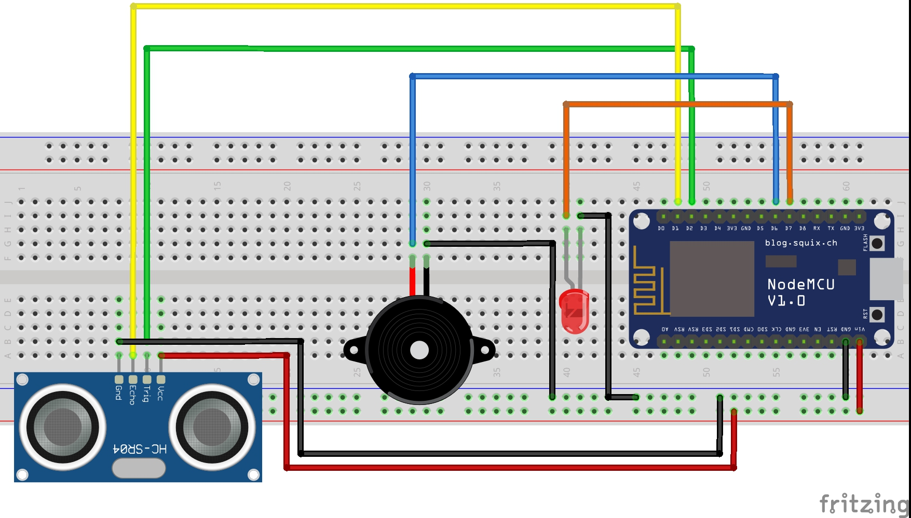

# Home Security Bot

This project is a smart home security system built using a NodeMCU, an ultrasonic sensor (HC-SR04), an LED, and a buzzer. The system detects motion and alerts by lighting up the LED, sounding the buzzer, and sending notifications to Telegram.

## Components

- NodeMCU v1.0
- HC-SR04 Ultrasonic Sensor
- LED
- Buzzer
- Breadboard
- Jumper wires

## Circuit Diagram

## How It Works

The HC-SR04 ultrasonic sensor measures the distance to an object. If an object comes within a certain distance, the NodeMCU triggers the LED and buzzer to alert the presence of an object or person, and sends a notification to a predefined Telegram channel.

## Setup Instructions

1. **Hardware Setup**
    - Connect the components as shown in the circuit diagram.
    - Ensure that all connections are secure and correct.

2. **Software Setup**
    - Install the Arduino IDE from [here](https://www.arduino.cc/en/Main/Software).
    - Install the NodeMCU board in the Arduino IDE. Follow the instructions [here](https://arduino-esp8266.readthedocs.io/en/latest/installing.html).
    - Connect the NodeMCU to your computer using a USB cable.
    - Open the `homesecuritybot.ino` file in the Arduino IDE.
    - Select the correct board and port from the Tools menu.
    - Upload the code to the NodeMCU.

## Usage

- Power the NodeMCU with a USB cable or a 5V power source.
- The ultrasonic sensor will continuously measure the distance.
- If an object is detected within the specified range, the LED will light up, the buzzer will sound, and a notification will be sent to Telegram.

## Demonstration

Watch the following video for a demonstration of the Home Security Bot in action:

<iframe width="560" height="315" src="https://www.youtube.com/embed/_iyvJMkf_yY" frameborder="0" allowfullscreen></iframe>

## Troubleshooting

- Ensure that the connections are secure and match the circuit diagram.
- Check that the NodeMCU is correctly connected to the computer and that the correct port is selected in the Arduino IDE.
- Make sure the ultrasonic sensor is functioning correctly.

## Contributing

If you'd like to contribute to this project, please fork the repository and use a feature branch. Pull requests are welcome.

## License

This project is licensed under the MIT License - see the [LICENSE](LICENSE) file for details.
